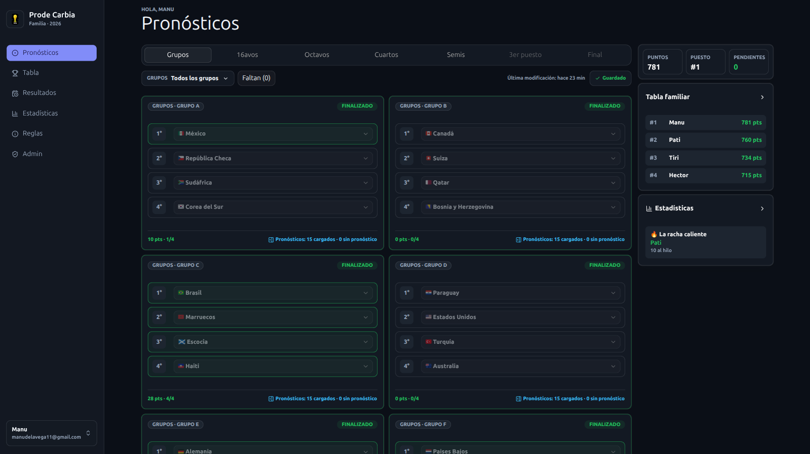
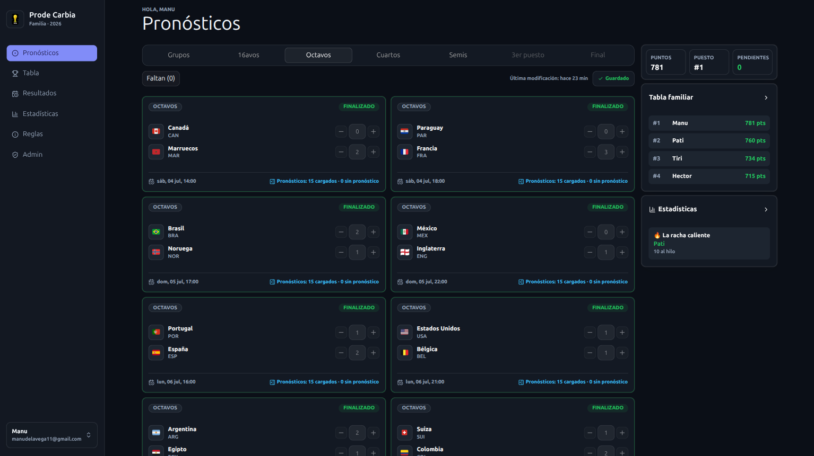
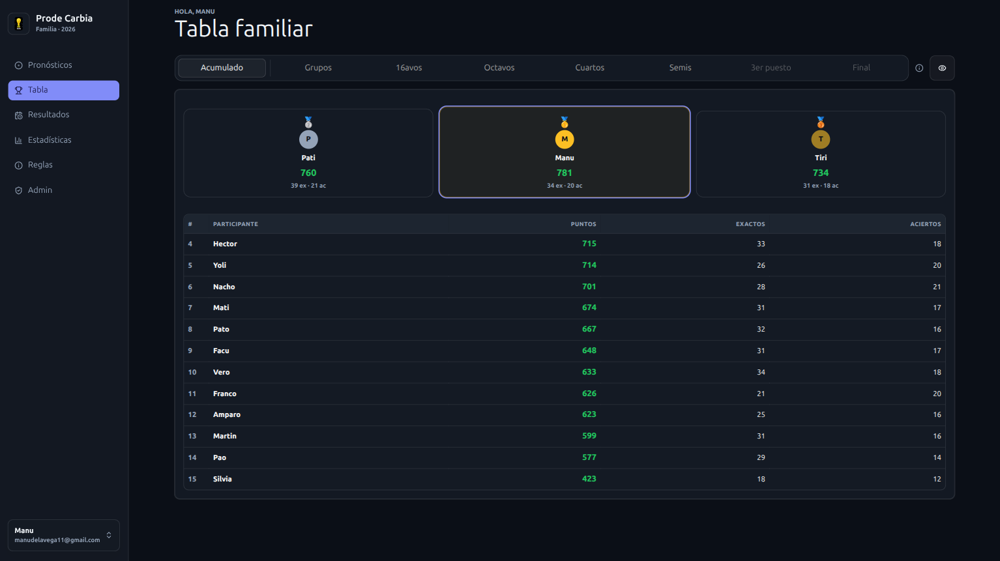
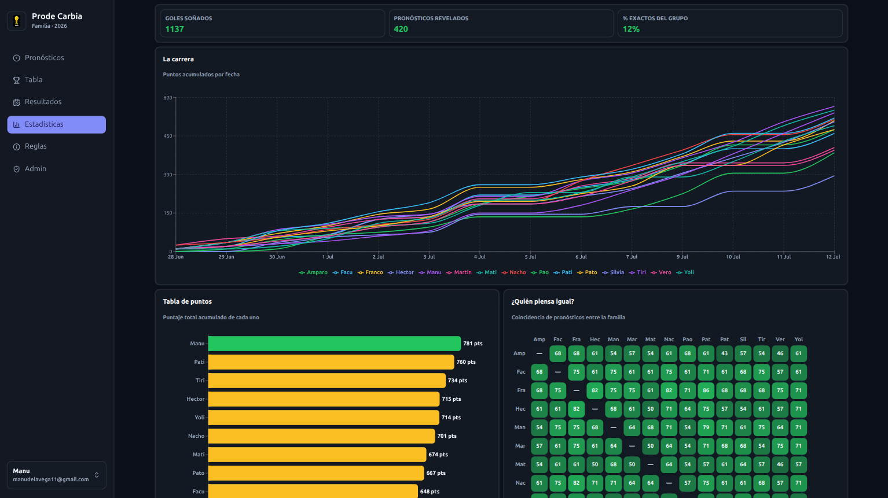

<div align="center">
  

  <h1>Prode Mundial 2026</h1>

  <p>A World Cup prediction pool for family and friends</p>

  <p>
    
    
    
    
    
  </p>
</div>

Everyone predicts match scores, points accumulate as results come in, and there's a leaderboard. One admin runs the whole thing. The app is in Spanish.

## Features

- **Predictions**: score predictions for every match, with steppers made for phones. Knockout matches with a tied score ask who advances.
- **Leaderboard**: total and per-stage points, and a toggle to include provisional results.
- **Results**: every match with its result, and a drawer that reveals everyone's predictions once the match kicks off.
- **Statistics**: points race over time, a "dream table" of predicted standings, accuracy distribution, favorite scorelines, goal margins, streaks, participation, and a similarity matrix that finds your prediction twin (and your opposite).
- **Admin**: approve users, manage teams and fixture slots, edit knockout crossings, load provisional/final results, import/export CSV, recalculate points, and show or hide each stage's tab.
- Light/dark/system theme, and a "Novedades" modal that announces new features in the app.

## Screenshots

| Predictions (group stage) | Predictions (round of 16) |
| :--: | :--: |
|  |  |

| Leaderboard | Statistics |
| :--: | :--: |
|  |  |

## How it works

Predictions are per match. You can fill the whole group stage upfront or go match by match. Knockout rounds only open once the real matchups are known, and the admin controls which stage tabs are visible.

Each prediction locks at kickoff. Once a match is locked or finalized you can open a drawer to see what everyone predicted (people who didn't predict show up as "Sin pronóstico").

Results can be entered by hand in the admin panel, or pulled automatically from [football-data.org](https://www.football-data.org/) via a cron job hitting `/api/sync-results`, which also recalculates scores and standings.

New accounts need admin approval before they can play. The admin plays too, under the same lock rules.

Scoring:

- 3 points for the exact score
- 1 point for the correct outcome (group stage) or the correct advancing team (knockout)
- 0 otherwise

If you predict a tied score in a knockout match you also have to pick who advances ("Clasifica"). If the score isn't tied, the advancing team is inferred.

## Stack

Next.js 15 (App Router) + React 19, Supabase for the database and auth, Tailwind 4, Recharts for the stats charts, Vitest for tests.

## Setup

You need a Supabase project:

1. Run `docs/supabase-schema.sql` in the SQL editor, then the `docs/supabase-migration-*.sql` files.
2. Run `docs/supabase-seed.sql` and `docs/supabase-seed-teams.sql` for the fixture.
3. Enable email/password auth. Turn off email confirmation if you don't want confirmation emails.
4. Create your account in the app, then promote it:

```sql
update public.profiles
set approved = true, role = 'admin'
where email = 'tu-email@example.com';
```

Copy `.env.example` to `.env.local` and fill it in. `NEXT_PUBLIC_SUPABASE_URL` and `NEXT_PUBLIC_SUPABASE_ANON_KEY` are enough to run the app; `FOOTBALL_DATA_TOKEN`, `SUPABASE_SERVICE_ROLE_KEY` and `CRON_SECRET` are only needed for the auto-sync job.

Then:

```bash
npm install
npm run dev
```

`npm test` runs the Vitest suite, `npm run lint` runs ESLint.

### Auto-sync

There's no cron config in the repo. Schedule something (Vercel cron, cron-job.org, whatever) to hit the sync endpoint during the tournament. It's a GET protected by a bearer token, so you can also trigger it by hand:

```bash
curl -H "Authorization: Bearer $CRON_SECRET" https://your-deploy.example/api/sync-results
```

## Layout

- `src/app`: routes, server actions, global CSS
- `src/screens`: one component per screen (predictions, leaderboard, results, admin...)
- `src/components`: shared UI
- `src/lib`: scoring, standings, stats, CSV import/export, tournament logic
- `src/lib/sync`: football-data.org ingestion and recalculation
- `docs`: SQL schema, migrations and seeds

`/pronosticos`, `/tabla`, `/resultados`, `/reglas` and `/admin` are all rewrites to `/` (see `next.config.ts`); the shell decides which screen to render.
